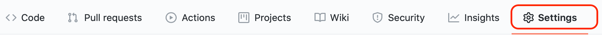
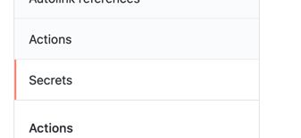
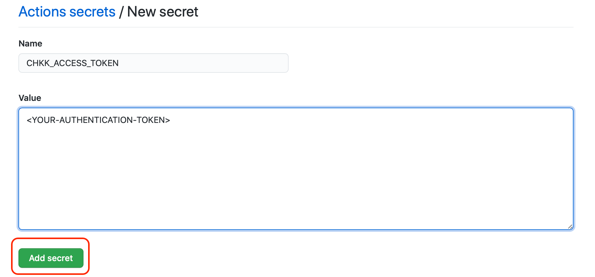

## Chkk Kubernetes Manifests Action

A [GitHub Action](https://github.com/features/actions) for using [Chkk](www.chkk.dev) to catch availability and security weaknesses in your Kubernetes manifests.

You can use the Action as follows:

```yaml
name: Example workflow for Chkk Kubernetes Manifests Action
on: push
jobs:
  kubernetes-manifests:
    runs-on: ubuntu-latest
    steps:
      - name: Run Chkk to catch availability and security weaknesses in your Kubernetes manifests
        uses: chkk-io/chkk-action@main
        env:
          CHKK_ACCESS_TOKEN: ${{ secrets.CHKK_ACCESS_TOKEN }}
        with:
          kubernetes-manifest: your/kubernetes-manifest.yaml
```

The Chkk Kubernetes Manifests Action has properties which are passed to the underlying CLI. These are passed to the action using `with`.

| Parameter           | Default | Description                                                  |
| :------------------ | :------ | ------------------------------------------------------------ |
| args                |         | Override the default arguments to the Chkk CLI               |
| kubernetes-manifest |         | The path to the Kubernetes manifest file you want to check.  |
| skip-checks         |         | A comma-separated list of checks you want to skip.           |
| enable-checks       |         | A comma-separated list of specific checks you want to run instead of running all checks. |


List of supported `args`

| Argument            | Default | Description                              |
| :------------------ | :------ | :--------------------------------------- |
| --hide-diff         | false   | Hide diff in result output               |


### Setup Access Token in GitHub repository secrets

1. Go to the settings tab in your repository menu.



2. From the side menu, select **Secrets**.



3. Add Chkk access token as a secret, shown below.



### Examples

#### To run all available checks

```yaml
on: [push]

jobs:
  kubernetes-manifests:
    runs-on: ubuntu-latest
    name: Run Chkk to catch availability and security weaknesses in your Kubernetes manifests
    steps:
    - uses: actions/checkout@v2
    - uses: chkk-io/chkk-action@main
      env:
        CHKK_ACCESS_TOKEN: ${{ secrets.CHKK_ACCESS_TOKEN }}
      with:
        kubernetes-manifest: 'k8s-manifest.yaml'
```

#### To skip specific checks

If you'd like to skip some checks on purpose, you can do so using by setting the `skip-checks` to the list of checks (Check IDs) to skip.

```yaml
on: [push]

jobs:
  kubernetes-manifests:
    runs-on: ubuntu-latest
    name: Run Chkk to catch availability and security weaknesses in your Kubernetes manifests
    steps:
    - uses: actions/checkout@v2
    - uses: chkk-io/chkk-action@main
      env:
        CHKK_ACCESS_TOKEN: ${{ secrets.CHKK_ACCESS_TOKEN }}
      with:
        kubernetes-manifest: 'k8s-manifest.yaml'
        skip-checks: 'CHKK-K8S-59,CHKK-K8S-65'
```

#### To run specific checks

If you'd like to run some checks, you can do so using by setting the `enable-checks` to the list of checks (Check IDs) to run.

```yaml
on: [push]

jobs:
  kubernetes-manifests:
    runs-on: ubuntu-latest
    name: Run Chkk to catch availability and security weaknesses in your Kubernetes manifests
    steps:
    - uses: actions/checkout@v2
    - uses: chkk-io/chkk-action@main
      env:
        CHKK_ACCESS_TOKEN: ${{ secrets.CHKK_ACCESS_TOKEN }}
      with:
        kubernetes-manifest: 'k8s-manifest.yaml'
        enable-checks: 'CHKK-K8S-36,CHKK-K8S-23,CHKK-K8S-27,CHKK-K8S-41'
```


#### To hide code diff in the output

```yaml
on: [push]

jobs:
  kubernetes-manifests:
    runs-on: ubuntu-latest
    name: Run Chkk to catch availability and security weaknesses in your Kubernetes manifests
    steps:
    - uses: actions/checkout@v2
    - uses: chkk-io/chkk-action@main
      env:
        CHKK_ACCESS_TOKEN: ${{ secrets.CHKK_ACCESS_TOKEN }}
      with:
        kubernetes-manifest: 'k8s-manifest.yaml'
        args: '--hide-diff'
```
